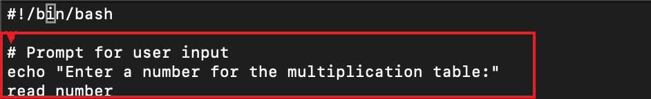
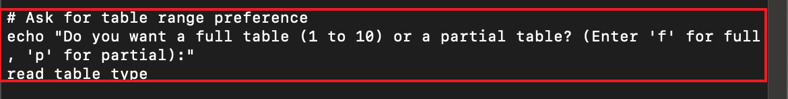
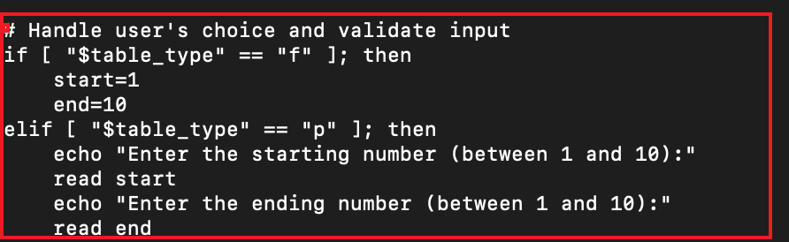
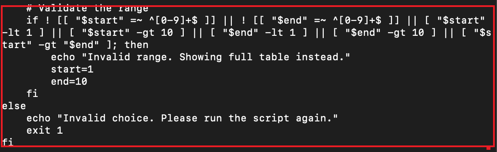
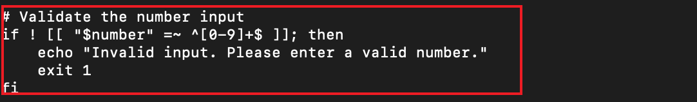
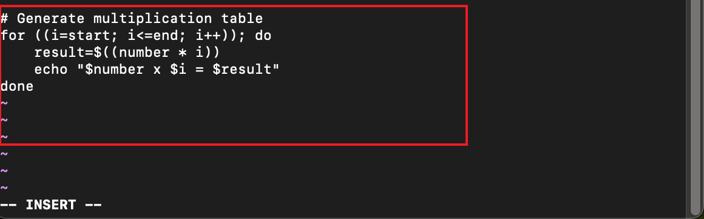

# Multiplication_table
This is a bash script for a multiplication table

## step 1

> After creating a file using command `touch multiplication_table.sh`

## step 2

> I prompt the user to enter a number for the mutiplication table. using command `echo "Enter a number for the mult read number`

## step 3

> I asked for a table range preference 
using command `echo "Do you want a full table (1 read table_type`

## step 4

> i use conditional logic to handle the user's

## step 5

>  i validated the range by ensuring the users inpute valid numbers

## step 6

> i ensure the user input valid numbers.

## step 7 

>  c-style loop is use to generate a mutiplication table based on the users inpute 

## step 8

> list form loop is use to generate a mutiplication table based on the users inpute 

# step 9

> output for the full  multiplication table

# step 9

> output for partial multiplication table

## step 10

> output from invalid range, this show the full mutiplication table 

